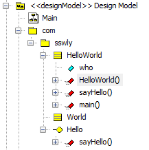
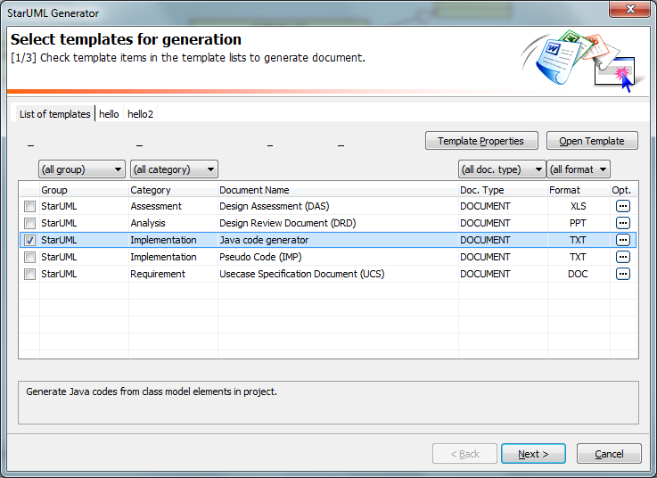
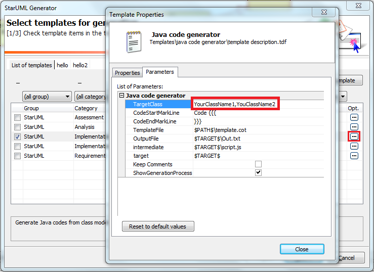
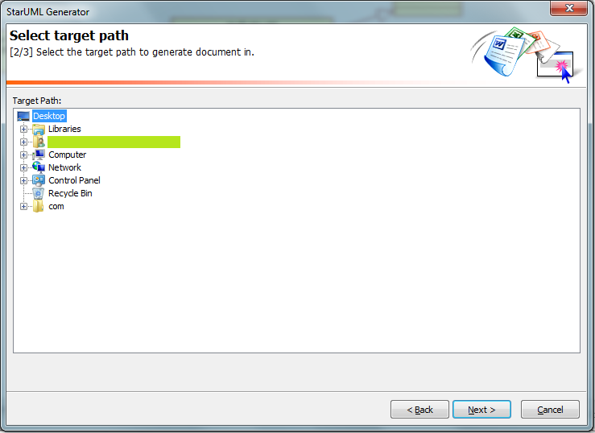
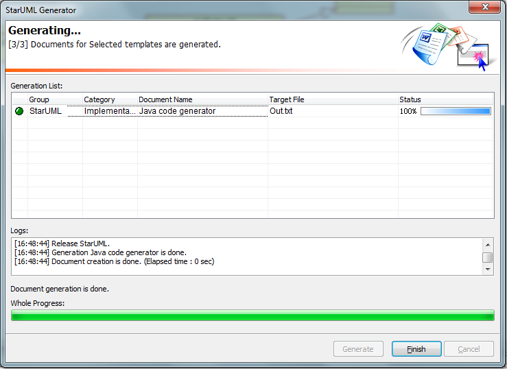

JavaCodeGenerator
=================
**UML to Java code.**

A Java code generator template for StarUML

Please reference the [examples](docs/example.md) for detail.


Feature
-------
* Generate the Java code according to the class define in class diagram
* Generate the Java code according to the interface define in class diagram
* Generalization and interface support for class and interface 
* Generate the import list according to the relationship 
* Generate method stub code if the method implementation code not define
* Generate the folder structure according to the package structure in class diagram
* Embed the method implementation code into the document of method with configurable mark line
* Generate the code comment that follow the Javdoc rule


Precondition
------------
1. Download and install [StarUML](https://sourceforge.net/project/showfiles.php?group_id=152825&package_id=169190&release_id=437438)


Installation
------------
1. Download the template files by  button of project main page
2. Uncompress the downloaded file and copy the JavaCodeGenerator folder into "StarUML_install_directory\modules\staruml-generator\templates"


Getting Started
---------------
1. Design your software by class diagram. Example: <br>
2. Open menu "Tools->StarUML Generator ..."<br>
3. Select "Java code generator" and configure it by "Opt." button if you want to customize it<br><br>
4. Click the "Next" button and select the directory that you want to store the generated code<br>
5. Click the "Next" button and press the "Generate" button at the following step<br>
6. Click the "Finish" button to finish the code generation<br>
7. Check the generated code in Eclipse:

```Java
/**
 * Copyright 
 *
 * @project Hello World
 *
 * @company 
 *
 * @author sswlymail@gmail.com
 */

/**
 * 
 */
public class HelloWorld {
    public String  who;


    /**
     * @param who 
     */
    public HelloWorld(String who){
        this.who = who;
    }

    /**
     */
    public void sayHello(){
        System.out.println(who + " say: Hello world!");
    }

    /**
     * @param args 
     */
    public static void main(String[] args){
        HelloWorld hello = new HelloWorld("Baby");
        hello.sayHello();
    }

}
```
