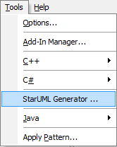
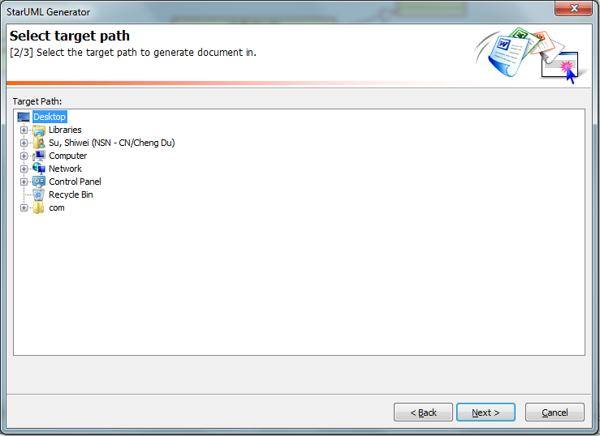
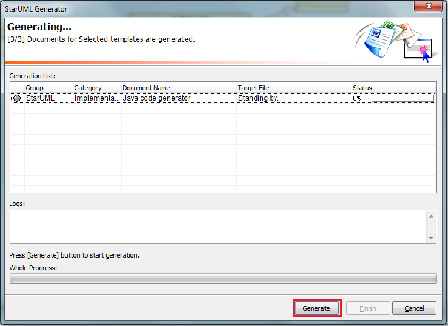

JavaCodeGenerator
=================
UML to Java code. 
A Java code generator template for StarUML

Precondition
------------
1. Install StarUML from https://sourceforge.net/project/showfiles.php?group_id=152825&package_id=169190&release_id=437438

Installation
------------
1. Download the template files includes folder
2. Copy the downloaded files and folder into "StarUML_install_directory\modules\staruml-generator\templates"

Usage
-----
1. Design your software by class diagram
2. Open menu "Tools->StarUML Generator ..." 
3. Select "Java code generator" and configure it by "Opt." button if you want to customize it  
4. Click the "Next" button and select the directory that you want to store the generated code 
5. Click the "Next" button and press the "Generate" button at the following step 
6. Click the "Finish" button to finish the code generation 

Feature
-------
* Generate the Java code according to the class define in class diagram
* Generate the Java code according to the interface define in class diagram
* Generalization and interface support for class and interface 
* Generate the folder structure according to the package structure in class diagram
* Embed the method implementation code into the document of method with configurable mark line
* Generate the code comment that follow the Javdoc define
