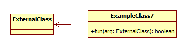
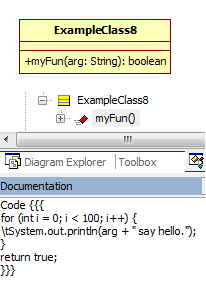

Example
=======
<table>
<tr>
<td></td>
<td></td>
<td><pre>
/**
 * Copyright 
 *
 * @project Untitled
 *
 * @company 
 *
 * @author 
 */

/**
 * 
 */
public class ExampleClass1 {
}</pre>
</td>
</tr>

<tr>
<td></td>
<td></td>
<td><pre>
/**
 * Copyright 
 *
 * @project Untitled
 *
 * @company 
 *
 * @author 
 */

/**
 * 
 */
public class ExampleClass2 {
    public int  publicAttribute;
    protected long  protectedAttribute;
    private float  privateAttribute;
    public static int  staticAttribute;
    public String  initialAttribute = null;

}</pre>
</td>
</tr>

<tr>
<td></td>
<td></td>
<td><pre>
/**
 * Copyright 
 *
 * @project Untitled
 *
 * @company 
 *
 * @author 
 */

/**
 * 
 */
public class ExampleClass3 {
    /**
     * 
     */
    public void publicFun(){
    }

    /**
     * 
     */
    protected int protectedFun(){
        // TODO Auto-generated method stub
        return 0;
    }

    /**
     * 
     * @param arg 
     */
    private void privateFun(int arg){
    }

    /**
     * 
     * @param arg 
     */
    public String staticFun(int arg){
        // TODO Auto-generated method stub
        return null;
    }

}</pre>
</td>
</tr>

<tr>
<td></td>
<td></td>
<td><pre>
/**
 * Copyright 
 *
 * @project Untitled
 *
 * @company 
 *
 * @author 
 */

import com.dummy.ParentClass;

/**
 * 
 */
public class ExampleClass4 extends ParentClass {
}</pre>
</td>
</tr>

<tr>
<td></td>
<td></td>
<td><pre>
/**
 * Copyright 
 *
 * @project Untitled
 *
 * @company 
 *
 * @author 
 */

import com.dummy.Interface;

/**
 * 
 */
public class ExampleClass5 implements Interface {
}</pre>
</td>
</tr>

<tr>
<td></td>
<td></td>
<td><pre>
/**
 * Copyright 
 *
 * @project Untitled
 *
 * @company 
 *
 * @author 
 */

import com.dummy.ExternalClass;

/**
 * 
 */
public class ExampleClass6 {
    public ExternalClass  attr;

}</pre>
</td>
</tr>

<tr>
<td></td>
<td></td>
<td><pre>
/**
 * Copyright 
 *
 * @project Untitled
 *
 * @company 
 *
 * @author 
 */

import com.dummy.ExternalClass;

/**
 * 
 */
public class ExampleClass7 {
    /**
     * 
     * @param arg 
     */
    public boolean fun(ExternalClass arg){
        // TODO Auto-generated method stub
        return false;
    }

}</pre>
</td>
</tr>

<tr>
<td></td>
<td></td>
<td><pre>
/**
 * Copyright 
 *
 * @project Untitled
 *
 * @company 
 *
 * @author 
 */

/**
 * 
 */
public class ExampleClass8 {
    /**
     * @param arg 
     */
    public boolean myFun(String arg){
        for (int i = 0; i &lt; 100; i++) {
            System.out.println(arg + " say hello.");
        }
        return true;
    }

}</pre>
</td>
</tr>

</table>
